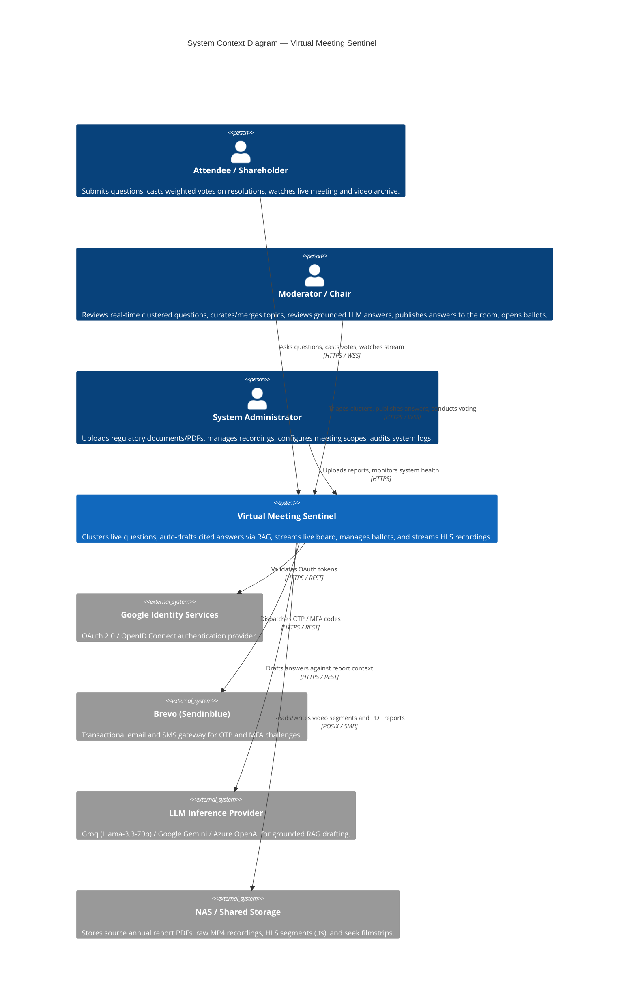
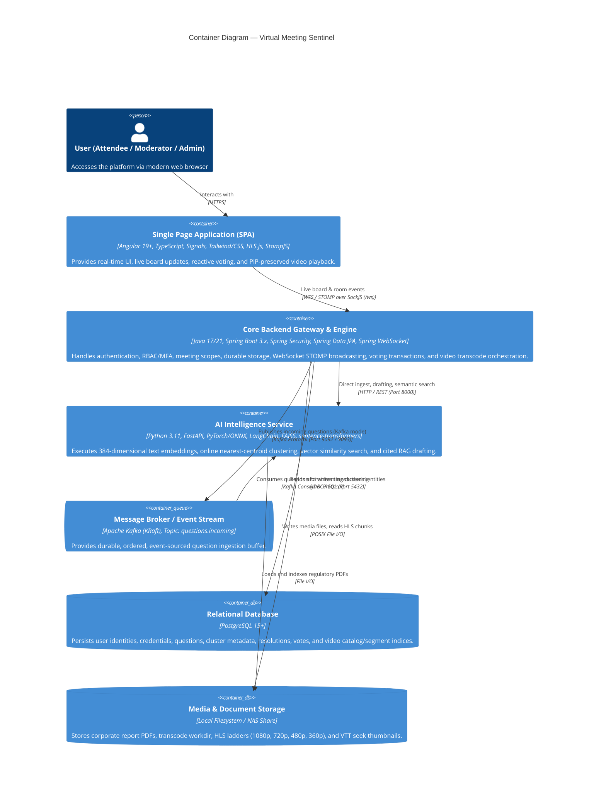
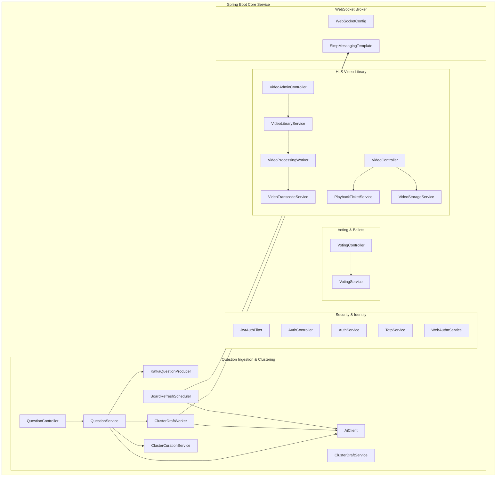
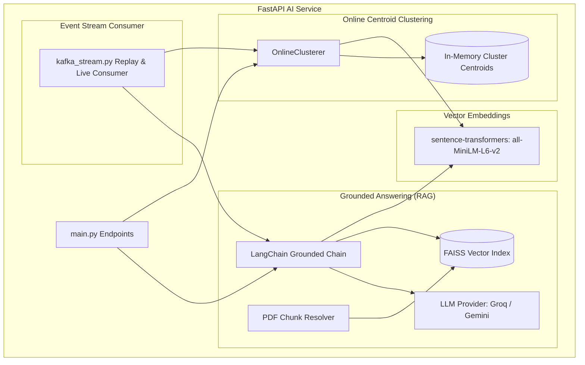
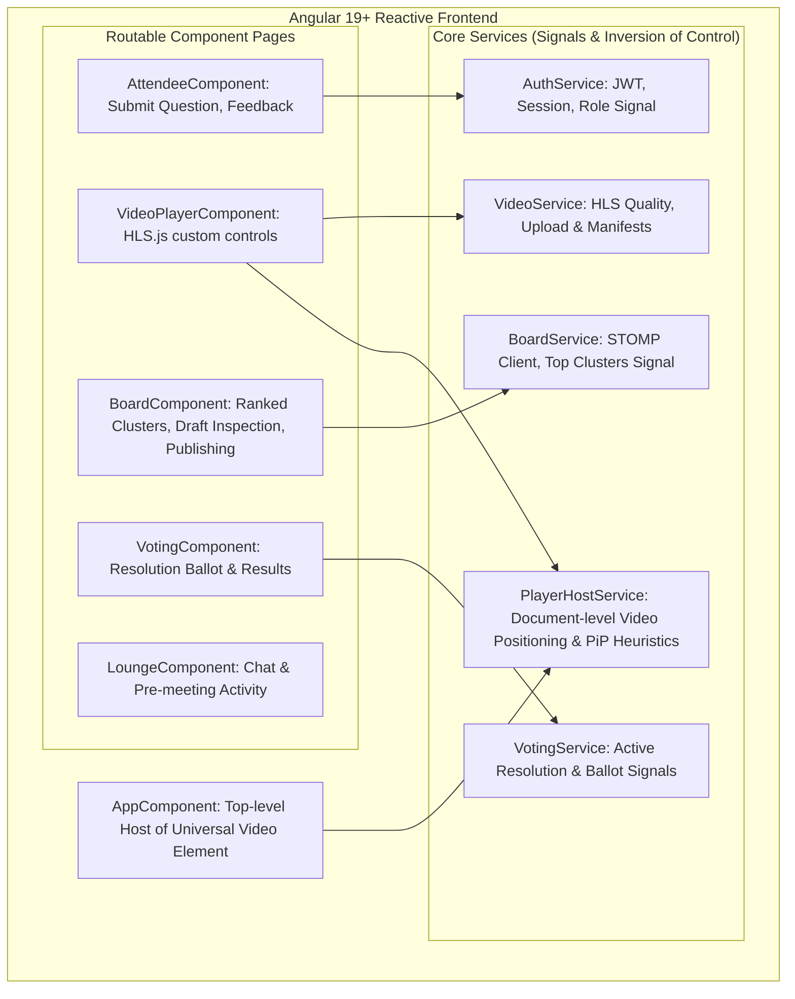
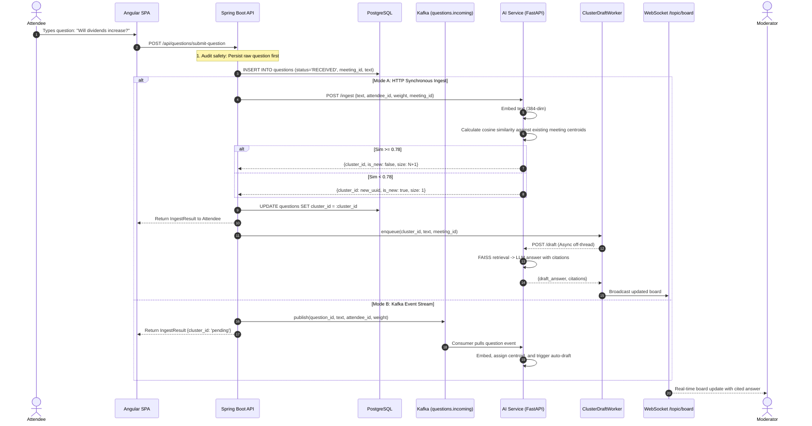
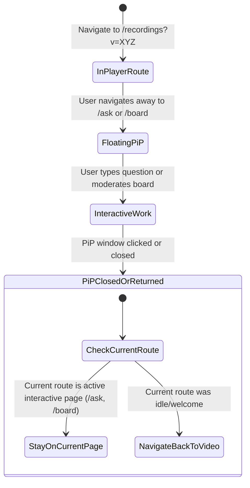
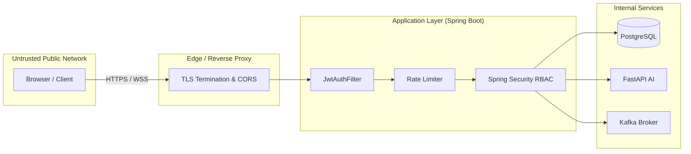

# Virtual Meeting Sentinel — Comprehensive C4 Architectural Blueprint

> **System Scope**: Real-time crowd-question intelligence, semantic deduplication, grounded RAG answering, secure voting governance, and adaptive HLS video streaming for Annual General Meetings (AGM) and large-scale corporate assemblies.

---

## 1. Executive Summary & Design Principles

During an Annual General Meeting with up to 10,000+ live participants, hundreds of questions arrive per minute. 60–70% are semantically duplicate inquiries ("What about the dividend?", "Will dividends increase this year?", "Payout ratio update?"). Human chairs and moderators cannot triage this flood manually without delaying meeting proceedings.

**Virtual Meeting Sentinel** provides:
1. **Instant Semantic Clustering & Deduplication**: Groups identical intents via incremental nearest-centroid clustering in vector space (cosine similarity $\ge 0.78$) rather than naive keyword matching.
2. **Deterministic & Grounded RAG Answering**: Answers top clusters using FAISS vector retrieval strictly confined to uploaded annual reports and regulatory filings, citing exact documents and pages without hallucination.
3. **Automated Background Drafting**: As soon as a question or cluster arrives, background workers (`ClusterDraftWorker`) trigger drafting off the request thread, ensuring moderators see pre-grounded answers immediately.
4. **Resilient Dual Ingestion Pipeline**: Supports both low-latency synchronous HTTP and event-sourced Apache Kafka streaming (`questions.incoming`), resilient against downstream AI hiccups.
5. **Legally Compliant Two-Phase Voting**: Enforces role boundaries, verified shareholder equity weighting, and secret balloting.
6. **Adaptive HLS Video Distribution with Persistent PiP**: Multi-rendition video transcode with DOM-anchored Picture-in-Picture that survives page transitions without exiting.

---

## 2. C4 Level 1 — System Context

The System Context diagram details how Virtual Meeting Sentinel interacts with human roles and third-party external services.



---

## 3. C4 Level 2 — Container Architecture

The Container diagram illustrates the high-level technology choices, container boundaries, and inter-service communication protocols.



### Container Responsibility Matrix

| Container | Runtime | Primary Responsibilities | Scaling Strategy |
|---|---|---|---|
| **Frontend SPA** | Nginx / Vercel / Cloudflare | Reactive UI, Signal state, DOM-level `<video>` coordination, WebSocket subscription | Static Edge CDN cache |
| **Spring Boot Core** | JVM (Container / VM) | Session verification, Question persistence, STOMP fan-out, Video laddering, Voting integrity | Horizontal stateless replicas with Redis STOMP relay |
| **Python AI Service** | Uvicorn / FastAPI | Vector embedding (`all-MiniLM-L6-v2`), online centroid clustering, LangChain FAISS retrieval | Replicated workers with shared FAISS index or pgvector |
| **Apache Kafka** | KRaft mode | Ingest queue decoupling, durability, event replay on boot | Partitioning by `meeting_id` |
| **PostgreSQL** | Managed Postgres | Canonical source of truth for users, questions, cluster curation, ballots | Read replicas for analytics, primary for writes |

---

## 4. C4 Level 3 — Component Diagrams

### 4.1 Backend Core Components (`backend`)



### 4.2 Python AI Service Components (`ai-service`)



### 4.3 Frontend Reactive Components (`frontend`)



---

## 5. C4 Level 4 — Detailed Operational Workflows

### 5.1 Real-Time Question Ingest, Dedup, and Background Drafting



### 5.2 Picture-in-Picture & Safe Route Transitions

To prevent browser W3C Picture-in-Picture sessions from aborting on navigation, the application strictly adheres to the following DOM layout:

```
[Document Root / AppComponent]
  ├── <header> Global Navigation </header>
  ├── <main> <router-outlet /> </main>   <-- Pages mount/unmount here (/ask, /board, /voting)
  └── <div class="player-host">
        └── <video #globalPlayer>       <-- NEVER unmounted; absolute positioned by PlayerHostService
```



---

## 6. Architectural Decision Records (ADRs)

### ADR-01: Polyglot Microservices Architecture
* **Context**: Need high-concurrency WebSocket broadcast, enterprise role-based security, and native AI/vector math.
* **Decision**: 
  - **Angular 19+**: Chosen for compile-time type safety, Signals-based zoneless reactivity, and real-time board rendering.
  - **Spring Boot 3.x**: Chosen for enterprise security (JWT, BCrypt, WebAuthn, TOTP), transactional data integrity, and multi-threaded WebSocket fan-out.
  - **Python FastAPI**: Chosen because the PyTorch, LangChain, FAISS, and sentence-transformers ecosystem natively resides in Python.
* **Consequences**: Requires well-defined HTTP/Kafka contracts between Java and Python.

### ADR-02: Document-Level `<video>` Preservation for PiP
* **Context**: Moving a `<video>` element across DOM hierarchies or unmounting it during Angular route changes causes the browser W3C PiP implementation to automatically terminate the picture-in-picture window.
* **Decision**: The `<video>` tag is mounted once at the `AppComponent` root and positioned over placeholder rectangles in `VideoPlayerComponent` using document coordinates.
* **Consequences**: Smooth PiP multitasking across tabs; requires coordinate synchronization on window resize.

### ADR-03: Durable Persistence Before Messaging
* **Context**: If Kafka or AI services experience transient network disconnects, questions submitted by shareholders could be permanently lost.
* **Decision**: All question submissions are written to PostgreSQL with status `RECEIVED` **prior** to invoking Kafka or HTTP ingest.
* **Consequences**: Zero question loss under network partition; ingestion can always be replayed.

### ADR-04: Fail-Fast Messaging Configuration
* **Context**: Default Kafka producer timeout in Spring is 60 seconds. A broker outage would lock HTTP worker threads, leading to thread pool exhaustion and cascading failures.
* **Decision**: Configured `max.block.ms=3000`, `request.timeout.ms=3000`, and `delivery.timeout.ms=5000` with dual listener configuration (`PLAINTEXT` and `PLAINTEXT_HOST`).
* **Consequences**: Failures surface in $<3$ seconds without exhausting server threads.

### ADR-05: Off-Thread LLM Answering on Cluster Creation
* **Context**: LLM inference takes 1.5–4.0 seconds. Blocking attendee submission for drafting degrades user experience. Waiting for moderators to manually click "Draft" causes delay in high-velocity meetings.
* **Decision**: `ClusterDraftWorker` auto-triggers drafting asynchronously in the background as soon as a cluster is initialized.
* **Consequences**: Answers are pre-grounded with citations before moderators even open the card.

---

## 7. Security Architecture & Threat Model



1. **Authentication**: Stateless HMAC-SHA256 JWT tokens with role claims (`ATTENDEE`, `SHAREHOLDER`, `MODERATOR`, `ADMIN`).
2. **Two-Factor Authentication**: TOTP RFC 6238 and FIDO2/WebAuthn hardware passkeys for administrative and moderator actions.
3. **Voting Non-Repudiation**: Ballots require authenticated `SHAREHOLDER` tokens with server-verified shareholding weights copied at ballot casting time, preventing retrospective vote tampering.
4. **Media Security**: Video recordings use short-lived, video-scoped HMAC playback tickets (`PlaybackTicketService`), preventing direct unauthorized hotlinking of NAS media bytes.

---

## 8. Summary Topology & Verification

| Metric | Specification | Verification Method |
|---|---|---|
| **Max Concurrent WebSocket Listeners** | 10,000+ | Non-blocking STOMP topic broadcast |
| **Dedup Cosine Threshold** | 0.78 (`all-MiniLM-L6-v2`) | Unit tested in `test_clustering.py` |
| **Max RAG Answer Length** | 120 words | Prompt constraint in `rag.py` |
| **Kafka Broker Failover Time** | $\le 3000$ ms | Spring Kafka producer timeout config |
| **Video Ladder Bitrates** | 1080p (4.5M), 720p (2.2M), 480p (800k), 360p (400k) | Verified via FFmpeg transcode pipeline |
